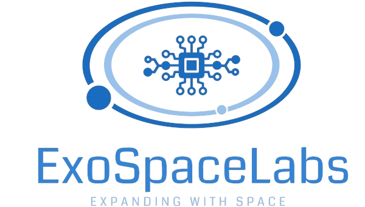

# ExoSpaceLabs

**Expanding with Space**

## About Us

ExoSpaceLabs is an open-source organization dedicated to developing cutting-edge software for space exploration, research, and real-time systems. Our goal is to provide high-performance, reliable, and scalable solutions that drive innovation in the aerospace industry.

### What We Offer
- **[CCSDSPack](https://github.com/ExoSpaceLabs/CCSDSPack)** – A powerful C++ library for handling CCSDS packet-based communication (current release v1.1.0).
- **[HardRT](https://github.com/ExoSpaceLabs/hardrt)** – HardRT is a minimal Real Time Operating System designed to be the core of more complex systems (current release v0.3.1).

### Future Projects May include ###
- **Space Data Processing** – Libraries and tools for handling space mission data efficiently.
- **Exploration & Simulation** – Software for simulating space environments and mission scenarios.
- **Acceletation Designs** – VHDL / Verilog designs to accelerate space related processing.

- **Modular payload systems** - Multi-device in coordination performing dedicated tasks.

Projects Status -> [here](../docs/PROJECTSTATUS.md)

## Vision & Mission
Our mission is to create robust and efficient software solutions that empower space agencies, researchers, and developers in the field of space technology. We believe in open collaboration and innovation to push the boundaries of exploration.

## Get Involved
We welcome contributors and collaborators who share our vision. If you're interested in helping us expand the frontiers of space software, feel free to:
- Fork and contribute to our projects
- Report issues and suggest improvements
- Join discussions and collaborate on new ideas

## Contact & Community
- **GitHub:** [ExoSpaceLabs](https://github.com/ExoSpaceLabs)
- **Discussions:** [GitHub Discussions](https://github.com/orgs/ExoSpaceLabs/discussions)
- **Email:** none@exospacelabs.org (placeholder)

---
🚀 *Join us as we expand with space!*

