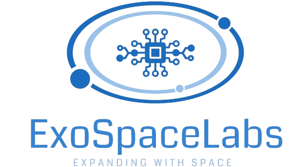

# ExoSpaceLabs



**Expanding with Space**

ExoSpaceLabs develops open-source engineering infrastructure for spacecraft communications, embedded avionics, real-time execution, simulation, and mission observability. The portfolio focuses on standards-based interfaces, practical hardware integration, reproducible builds, and software that can move from desktop simulation to representative embedded targets through stable engineering contracts.

## Project Portfolio

| Project | Lifecycle | Description |
| --- | --- | --- |
| **[CCSDSPack](https://github.com/ExoSpaceLabs/CCSDSPack)** | **Stable / v2.0.0** | C++17 library for CCSDS Space Packets and ECSS PUS-A/PUS-C TM/TC. v2.0.0 is the current public baseline, with bounded parsing, structured validation, CUC time, installed-package support, hosted CI, native arm64 validation, and physical Cortex-M7 execution evidence. |
| **[SpWKit](https://github.com/ExoSpaceLabs/spwkit)** | **Stable v0.5.0 / v0.6 development** | Portable C11 SpaceWire toolkit with an optional C++17 wrapper, deterministic local simulation, distributed VSPW-TP/UDP links, Linux VSPD/CUSE virtual-device paths, hosted POSIX/Windows support, and no-heap embedded/RTOS integration contracts. v0.6 adds a reusable hardware-driver/DMA boundary and CCSDSPack v2 interoperability evidence without claiming a physical SpaceWire implementation. |
| **[EXN](https://github.com/ExoSpaceLabs/exn)** | **Modernization** | Modular satellite-avionics demonstration platform spanning Raspberry Pi payload processing, STM32 control software, FPGA acceleration, shared CCSDS/PUS interfaces, and ground/HIL tooling. The current integration baseline is being migrated to CCSDSPack 2.x; SpaceWire/SpWKit adoption is a separate planned integration decision. |
| **[EXN-GS](https://github.com/ExoSpaceLabs/exn-gs)** | **Modernization** | C++17 ground-control and HIL environment with daemon, FTXUI terminal interface, command-line control, Serial/TCP links, CCSDS/PUS handling, and an STM32-oriented simulator. Its dependency setup is being migrated to a reproducible CCSDSPack 2.x package contract. |
| **[HardRT](https://github.com/ExoSpaceLabs/hardrt)** | **Active** | Small portable real-time operating system written in C, with static tasks, configurable scheduling, semaphores, mutexes, message queues, POSIX/Cortex-M ports, and an optional C++17 wrapper. Current release: **v0.4.0**. |
| **[WorldSat Monitor](https://github.com/ExoSpaceLabs/world-sat-monitor)** | **Active** | Self-hosted satellite and constellation situational-awareness platform with backend SGP4 propagation, persistent object/group management, public orbital-data ingestion, and an interactive 3D Earth interface. Current release: **v1.0.0**. |

## Current Integration Priority

CCSDSPack **v2.0.0 is now the released packet-layer baseline** for downstream work:

```text
CCSDSPack 2.0.0 [released]
├── SpWKit v0.6: finalize immutable v2.0.0 interoperability evidence
│   └── complete portable hardware-driver/DMA integration boundary
└── EXN / EXN-GS: migrate CCSDS/PUS consumers to the released 2.x contract
    └── evaluate/adopt SpWKit separately where SpaceWire transport is required
```

SpWKit **v0.5.0 is also released**. Development has moved to v0.6.0, where the portable driver backend, DMA/zero-copy ownership mapping, deterministic host reference driver, and deployment-shaped two-node CCSDS-over-UDP example are already implemented on `develop`.

1. **CCSDSPack:** treat v2.0.0 as the stable integration contract; keep new protocol scope and future features outside the released v2 baseline unless handled through normal 2.x maintenance/versioning.
2. **SpWKit:** repin the existing CCSDSPack interoperability fixture from its validated post-release snapshot to the immutable v2.0.0 tag and rerun the evidence; complete STM32H755 DMA/cache runtime validation, document the public proprietary-safe FPGA/driver boundary, then close the v0.6 release audit.
3. **EXN:** migrate current CCSDS/PUS consumers and shared definitions to CCSDSPack 2.x, remove developer-local dependency assumptions, restore clean-checkout CI/HIL validation, and only claim SpaceWire/SpWKit integration once that transport is implemented and tested.

Detailed lifecycle and release state is maintained in **[Project Status](../docs/PROJECTSTATUS.md)**.

## Engineering Focus

- **Space communications:** CCSDS Space Packets, ECSS PUS, SpaceWire transport, command/telemetry handling, and protocol validation.
- **Embedded and real-time systems:** STM32/Cortex-M software, FPGA-facing interfaces, portable RTOS primitives, deterministic execution, and hardware-oriented integration boundaries.
- **Simulation and HIL:** host-side device simulation, fault injection, ground-segment tooling, distributed virtual links, and reproducible integration environments.
- **Mission observability:** satellite tracking, orbital propagation, telemetry visualization, state persistence, and operational dashboards.
- **Release engineering:** CMake packages, binary artifacts, multi-platform CI, external-consumer validation, documentation, and versioned compatibility contracts.

## Engineering Principles

Projects are expected to have a defined scope, documented public interfaces, automated validation, explicit compatibility/versioning, and a credible route to representative hardware or integration testing. Experimental work should be clearly identified and separated from supported release baselines.

## Contributing

Issues and pull requests are welcome where a repository is open for contribution. Please use each repository's documentation and issue tracker for project-specific requirements, compatibility constraints, and current priorities.

## Contact

- **GitHub:** [ExoSpaceLabs](https://github.com/ExoSpaceLabs)
- **Discussions:** [GitHub Discussions](https://github.com/orgs/ExoSpaceLabs/discussions)
- **Email:** exospacelabs@gmail.com

Repository-level license files are authoritative for each project.
